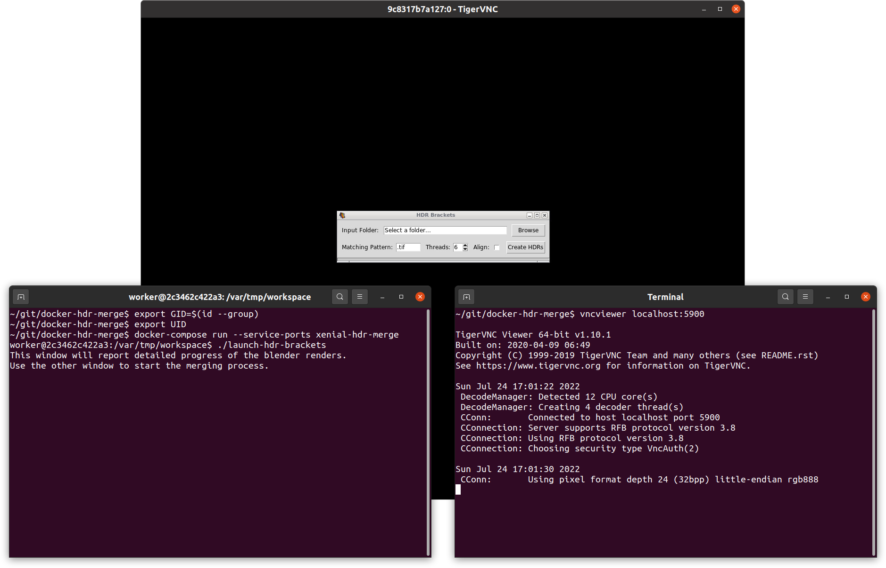

Docker HDR Merge
================

Greg Zaal (the person behind [Poly Haven](https://polyhaven.com/)) created the project [HDR-Merge](https://github.com/gregzaal/HDR-Merge) for merging images into HDRIs.

However, it depends on ancient versions of LuminanceHDR (2.4.0) and Blender (2.7.9). The Blender version is easy enough to acquire but the LuminanceHDR version is unbuildable on recent versions of Ubuntu.

The last version of Ubuntu that shipped with LuminanceHDR 2.4.0 was 17.10 ([Artful Aardvark](https://wiki.ubuntu.com/ArtfulAardvark/ReleaseNotes)).

I tried building LuminanceHDR 2.4.0 locally on a modern Ubuntu distribution but after a lot of effort, I just got to the point where it was impossible to get further and switched to doing things via Docker.

Running
-------

The installation step below just needs to be done once. After that you can start up HDR-Merge at any time as described here.

**1.** Open a terminal window and:

```
$ cd path/to/docker-hdr-merge
$ export GID=$(id --group)
$ export UID
$ docker-compose run --service-ports xenial-hdr-merge
worker@2c3462c422a3:/var/tmp/workspace$
```

**2.** Open another terminal window and:

```
$ vncviewer localhost:5900
```

When prompted for a password, enter `secret`.

**3.** Return to the first terminal window and:

```
worker@2c3462c422a3:/var/tmp/workspace$ ./launch-hdr-brackets
```

HDR-Merge will open, after a few seconds, in the VNC client window (see screenshot below).

If `launch-hdr-brackets` exits immediately with the following error, it just means you tried to run it before creating the first VNC connection, i.e. before starting `vncviewer`:

```
Error: X is not available
```

As noted below, the X virtual frame buffer is only created when the first client connects.


Installation
------------

Clone this repository:

    $ git clone git@github.com:george-hawkins/docker-hdr-merge

Change directory into the root of the cloned repository and then clone Greg's HDR-Merge repository:

    $ cd docker-hdr-merge
    $ git clone git@github.com:gregzaal/HDR-Merge.git

HDR-Merge needs to know where some executables are going to be - so provide it with the JSON file which contains these details:

    $ cp exe_paths.json HDR-Merge

Retrieve and unpack the ancient Blender 2.79 version for Linux:

    $ curl -O https://download.blender.org/release/Blender2.79/blender-2.79b-linux-glibc219-x86_64.tar.bz2
    $ tar -xf blender-2.79b-linux-glibc219-x86_64.tar.bz2
    $ rm blender-2.79b-linux-glibc219-x86_64.tar.bz2

Set up UID and GID (so that the `docker-compose.yml` file can pick them up to set the correct ownership on output files):

    $ export GID=$(id --group)
    $ export UID

Note: `UID` already exist as a shell variable so, unlike `GID`, you just need to `export` it (without also giving it a value).

Build the docker image:

    $ docker-compose build

Note: during the build, you'll see `debconf: delaying package configuration, since apt-utils is not installed` - despite being displayed in red, this is just a warning rather than an error.

Then to run:

    $ docker-compose run --service-ports xenial-hdr-merge

This will launch a container and open a bash prompt from which HDR-Merge can be started. You'll see a prompt something like this:

    worker@00b38ed967d7:/var/tmp/workspace$

If you do `pwd`, you'll see that you're in `/var/tmp/workspace` but if you do `ls`, you'll see that your current directory on the host machine has been mapped to this directory:

    worker@00b38ed967d7:/var/tmp/workspace$ pwd
    /var/tmp/workspace
    worker@00b38ed967d7:/var/tmp/workspace$ ls
    Dockerfile  HDR-Merge  README.md  blender-2.79b-linux-glibc219-x86_64  docker-compose.yml  env  launch-hdr-brackets  startup

Set up Python:
    
    worker@00b38ed967d7:/var/tmp/workspace$ python3 -m venv venv
    worker@00b38ed967d7:/var/tmp/workspace$ source venv/bin/activate

At this point, I'd usually upgrade `pip` but if you do that in this setup, you'll get a version that's incompatible with the ancient version of Python that's part of this distribution.

Now, install the packages needed by HDR-Merge:

    (venv) worker@00b38ed967d7:/var/tmp/workspace$ pip install exifread

HDR-Merge has a [`tkinter`](https://docs.python.org/3/library/tkinter.html) GUI interface. To support this the Docker container use [Xvfb](https://en.wikipedia.org/wiki/Xvfb) and [VNC](https://en.wikipedia.org/wiki/Virtual_Network_Computing).

So in another terminal window, you need to connect to the container's virtual display.

Remmina is Ubuntu's default remote desktop client, but I found it crashed repeatedly when trying to access this setup - so I used [TigerVNC](https://tigervnc.org/) instead, and this worked perfectly:

    $ sudo apt install tigervnc-viewer

Then to connect:

    $ vncviewer localhost:5900

This is a little slow initially as the virtual frame buffer is only created when the first client connects. After a few seconds, it prompts for a password - the default is `secret`.

If you want to specify a different password, you can specify it like so when running `xenial-hdr-merge`:

    $ VNC_PASSWORD=1234 docker-compose run --service-ports xenial-hdr-merge

Note: initially, I ran things without any password, but some VNC clients refuse to work without one.

Once connected, you should just see a black window with no content. Return to the terminal window with the container's bash prompt and launch HDR-Merge:

    worker@00b38ed967d7:/var/tmp/workspace$ launch-hdr-brackets

Unfortunately, as `tkinter` on Linux does not support the Windows `.ico` format, you'll get an error like this:

```
Traceback (most recent call last):
  File "/var/tmp/workspace/HDR-Merge/hdr_brackets.py", line 389, in <module>
    main()
  File "/var/tmp/workspace/HDR-Merge/hdr_brackets.py", line 383, in main
    root.iconbitmap(str(SCRIPT_DIR / "icons/icon.ico"))
  File "/usr/lib/python3.5/tkinter/__init__.py", line 1719, in wm_iconbitmap
    return self.tk.call('wm', 'iconbitmap', self._w, bitmap)
_tkinter.TclError: bitmap "/var/tmp/workspace/HDR-Merge/icons/icon.ico" not defined
```

To resolve this, just open the file `HDR-Merge/hdr_brackets.py` and find the following line and comment it out, i.e. put a `#` before the `root`.

```
root.iconbitmap(str(SCRIPT_DIR / "icons/icon.ico"))
```

This will mean the application has no icon, if you really want an icon, replace the line with these two likes:

```
img = PhotoImage(file=str(SCRIPT_DIR / "icons/icon.png"))
root.tk.call('wm', 'iconphoto', root._w, img)
```

Now, you should be able to successfully launch HDR-Merge with `launch-hdr-brackets`. This will open a small GUI in the VNC window (it'll take a few seconds to appear). At this point you should have three windows looking like this:



TODO
----

I found the threads stuff failed (it looked like something simple but I didn't investigate), I just changed the code to make the calls directly rather than spawning threads. See `git diff`.

Notes
-----

`F8` brings up the Tiger VNC context menu.

If you accidentally minimize something, it can be difficult to get it back without any desktop environment. The solution:

* Press `F8` to bring up the Tiger VNC menu.
* Tick the _Alt_ menu item.
* Now press `tab`.

Once you've found the window, you have to untick _Alt_ in order to release it and see your window.

Once `x11vnc` has been started once, it'll leave `Xvfb` running in the background even if you kill `x11vnc`. So if you restart `x11vnc`, any changes you then make to `FD_PROG` etc. have no effect as it simply reuses to the existing `Xvfb` instance.

While Artful Aardvark is the last version of Ubuntu with LuminanceHDR 2.4.0, the Ubuntu version used by the [`Dockerfile`](Dockerfile) is `ubuntu:xenial` as Xenial is the last LTS version with the appropriate version of LuminanceHDR and is more easily available as an image than non-LTS versions like Artful Aardvark.
